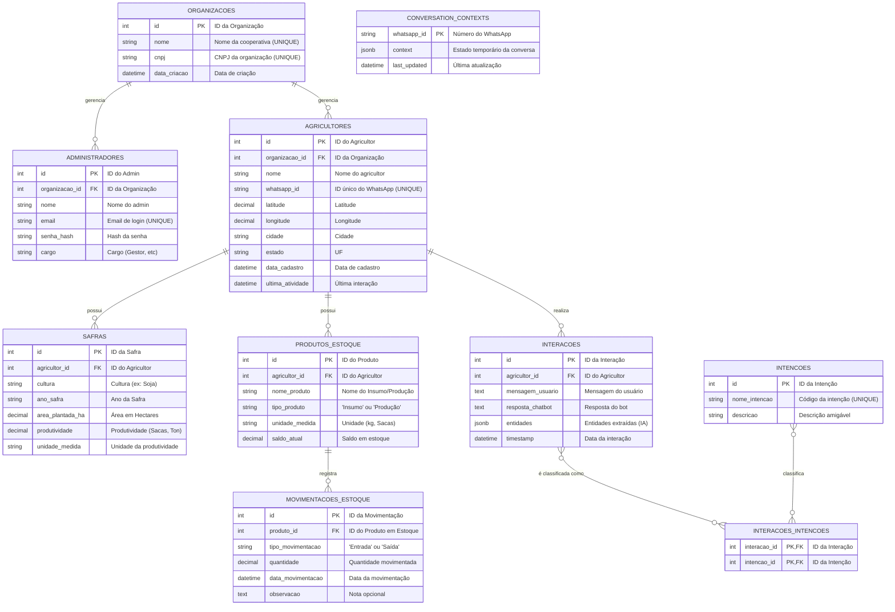

# 📘 Diagrama ER (Entidade-Relacionamento)

**Sistema:** Campo Inteligente  
**Versão:** 2.0  
**Data:** 07/07/2025  
**Responsável:** Arthur Martins

## A plataforma "Campo Inteligente" é uma API de Backend como Serviço (BaaS) projetada para permitir que terceiros (nossos clientes, como cooperativas e empresas) implementem chatbots inteligentes para seus próprios usuários finais (os agricultores). A plataforma fornece toda a infraestrutura de backend, integrações com IAs e APIs de dados (clima, mercado), no frontend, temos um site institucional com acesso a um Painel de Controle para que cada cliente possa gerenciar sua instância do chatbot.

### Entidades principais:

O modelo de dados é projetado para ser "multi-tenant", onde a tabela `Organizacoes` é a entidade central que garante o isolamento dos dados entre os diferentes clientes da plataforma. As principais entidades são:

- **Organizacoes:** Representa os clientes da plataforma (cooperativas, empresas).
- **Administradores:** Usuários do Painel de Controle, pertencentes a uma Organização.
- **Agricultores:** Usuários finais do chatbot, gerenciados por uma Organização.
- **Safras:** Histórico de produção de cada agricultor.
- **Produtos_Estoque** e **Movimentacoes_Estoque**: Entidades para a funcionalidade de controle de estoque.
- **Interacoes** e **Intencoes**: Entidades para registrar e categorizar as conversas do chatbot.

---

### Modelo Lógico:

O diagrama abaixo representa a estrutura completa do banco de dados, com todas as tabelas e seus relacionamentos principais. Você pode acessar a documentação oficial com todas as descrições pelo link: [Documentação_BD](https://docs.google.com/document/d/1w_fsAb6NAmlDi6_D95_dOTy9vLPk28VYOWPxD8mb3Bg/edit?usp=sharing)

